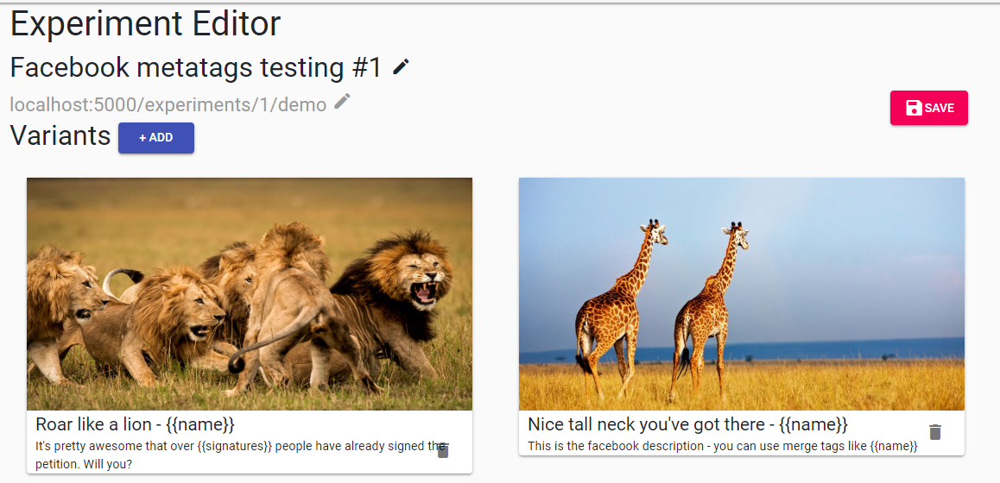
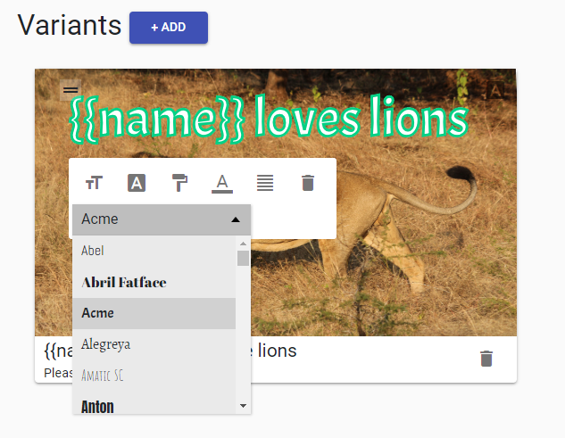

# Share Harder

This allows you to test multiple variants of title, description and image of the share preview on Facebook. It uses a [bandit algorithm](https://en.wikipedia.org/wiki/Thompson_sampling) to find the best variant much more quickly than conventional A/B testing.

You add overlay text to the image, and personalise the title, description and image text with merge tags.

You can also create personalized image generators (for memes, email embeds, customised share graphics and more).

Inspired by [ShareBandit](https://github.com/MoveOnOrg/sharebandit)




# Try it out - deploy a working version of the app to Heroku now

[](https://heroku.com/deploy)

Required ENV variables:
 - APP_URL - this needs to be set to https://your-app-name.herokuapp.com (no trailing slash)
 - GOOGLE_FONTS_API_KEY - this needs to be set to use text overlays on share images

## Dev Setup

The app uses Ruby on Rails with React / Redux for the front end (in order to achieve as many 'R's as possible).

Dependencies:
 - Ruby
 - Postgres
 - Redis
 - Node
 - Yarn (Node package management)

Once you have these setup you can run the following to set the app up locally.

```
git clone https://github.com/jamesr2323/facebook_share_tester.git
cd facebook_share_tester
bundle install
createdb facebook_share_tester_dev
```

Add the connection string for the local database to a .env file in the app root directory. `DATABASE_URL=.....`

```
foreman run rake db:schema:load
foreman start -f Procfile.dev
```

## ENV variables
 - GOOGLE_CLIENT_ID - Used for OAuth login, get it from the Google Cloud console
 - GOOGLE_CLIENT_SECRET

## User documentation

User documentation is inline, accessed by clicking the "Help" button on the right of the screen. Docs are loaded from the `/docs` directory within the template folder for the current view. E.g. Docs for `/experiments` would be loaded from `/app/views/experiments/docs/_index.html.erb`.

## Tests

Create a database and add it to a new `.env.test` file `DATABASE_URL=...`

```
RAILS_ENV=test rake db:schema:load
RAILS_ENV=test rspec
```
